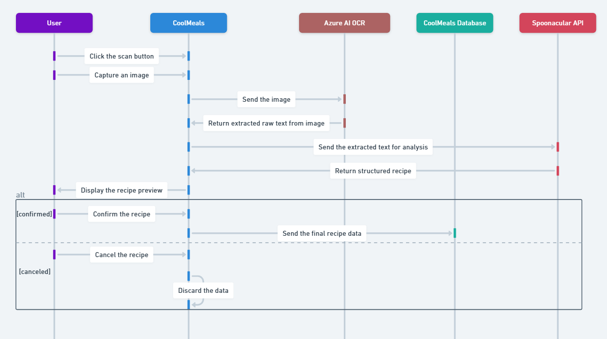

# 🍲 CoolMeals
> A web application that helps users efficiently manage ingredients and culinary preferences, offering personalized dish suggestions based on their tastes and what's on hand. It also streamlines meal planning and shopping list management.

## Table of Contents
* [General Info](#general-information)
* [Technologies](#technologies-used)
* [Features](#features)
* [Setup](#setup)
* [Examples](#examples)
* [Database Diagram](#database-diagram)
* [Sequence Diagrams](#sequence-diagrams)
* [Project Status](#project-status)
* [Room for Improvement](#room-for-improvement)
* [Acknowledgements](#acknowledgements)

## General Information
- 🥗 **CoolMeals** helps users organize ingredients and recipes while suggesting meals based on preferences and available items.
- 📈 It integrates with the Spoonacular API to retrieve detailed information about ingredients and recipes.
- 🧑‍🍳 This project was undertaken to provide a helpful tool for cooking enthusiasts and those who want an organized approach to meal prep.

## Technologies Used
- .Net 9
- C#
- ASP.NET Core MVC
- Entity Framework Core - for database management and ORM
- SQL Server - as the main database system
- Blob Storage
- XUnit - for unit testing
- NSubstitute - for mocking dependencies

## Features
- **Ingredient & Pantry Management**: Users can manage their personal pantry by adding, updating, and removing ingredients, organized by storage locations (e.g., fridge, freezer, cupboard).
- **Dietary Preferences & Intolerances**: Users can specify dietary preferences (e.g., vegan, keto) and intolerances, which the app considers when suggesting recipes.
- **Recipe Suggestions**: The app suggests recipes based on user's available ingredients and preferences.
- **Recipe Management**: Users can browse recipes from the Spoonacular API or create their own. Recipes can be saved, marked as favorites, and organized into meal plans.
- **Meal Planning**: Users can create weekly or custom meal plans by assigning recipes to specific days and meal types (e.g., breakfast, lunch, dinner).
- **Shopping List Generation**: Automatically builds shopping lists by comparing selected recipes against pantry contents, highlighting missing ingredients with quantities and units.

## Setup
> 🚧 This section is under construction and will be completed in a future update.

## Examples
> 🖼️ This section will include screenshots and walkthroughs of the application’s key features and user flows. Visual examples are coming soon.

## Database Diagram
🗄️ The database design, illustrating tables, relationships, and key attributes.

## Sequence Diagrams
The following diagrams illustrate key workflows and interactions in the CoolMeals app:

1. View All Ingredients

2. Generate Shopping List

3. Add Recipe Manually

4. Add Recipe by Scanning

5. Recipe Suggestions Based on User Data

## Project Status
Project is: _in progress_ 🛠️

## Room for Improvement

## Acknowledgements
- Special thanks to the Spoonacular API for recipe and ingredient data.